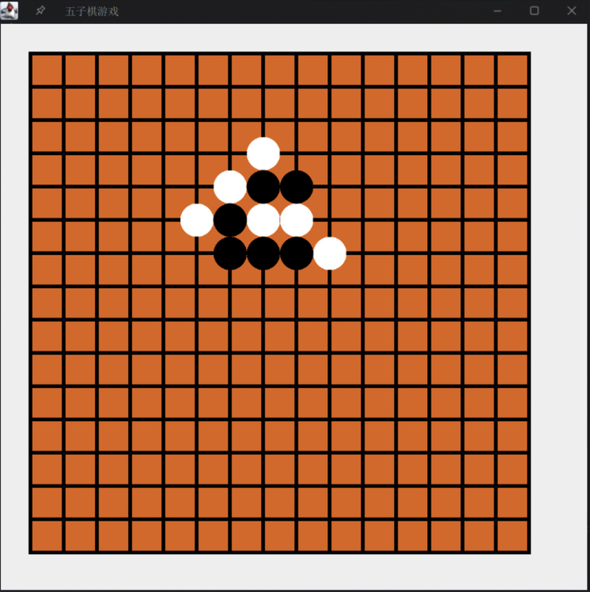
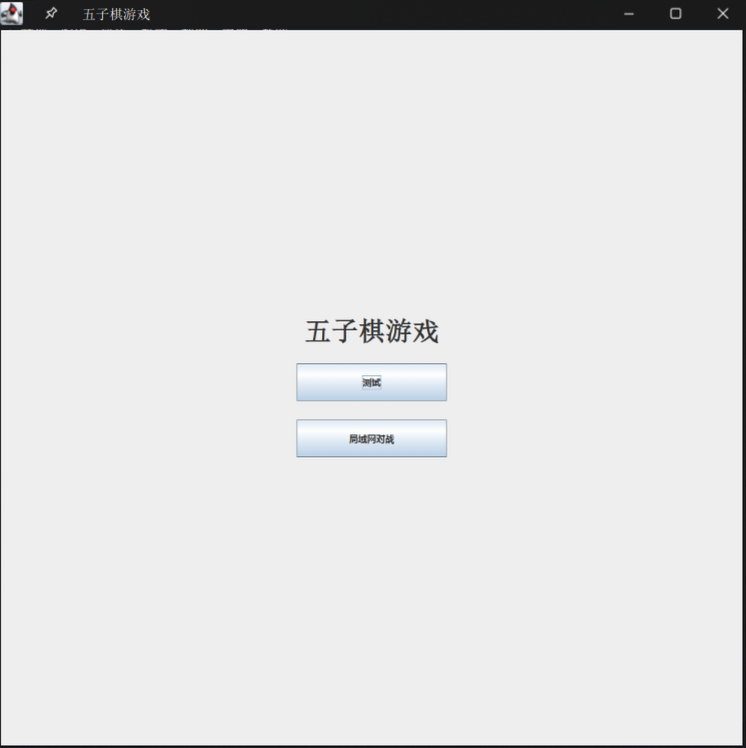
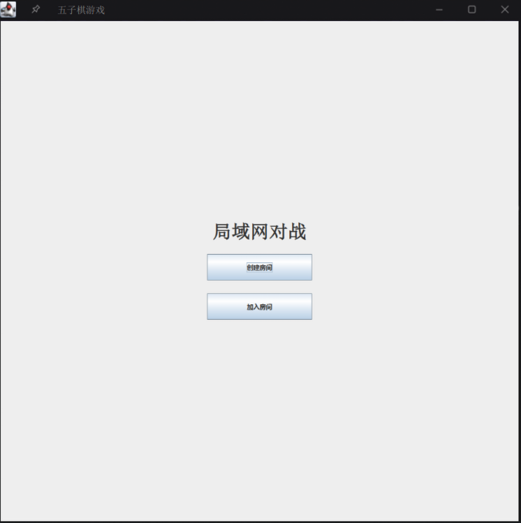
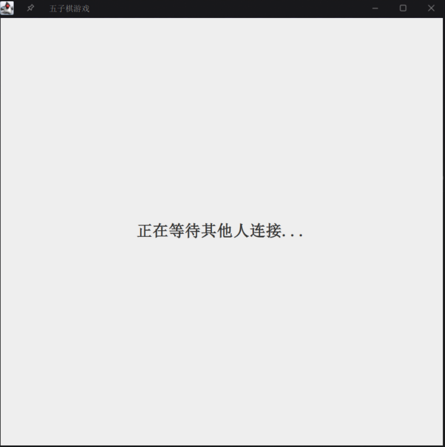
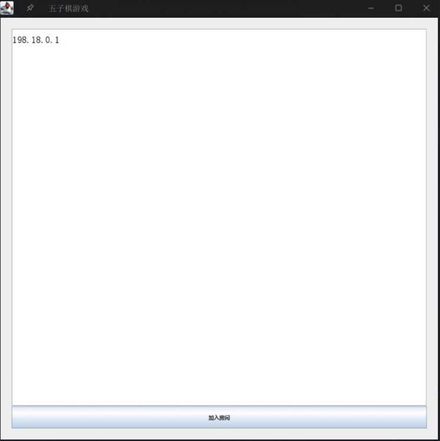

<div align="center">
  
  <h1 align="center">局域网五子棋游戏</h1>
</div>

## 项目介绍

基于 Java Swing 框架实现的局域网五子棋游戏，主要目的在于学习和巩固 Java 相关知识

## 项目依赖

-   JDK8+

## 项目结构

```
src/
├── ApplicationBoot.java                  // 程序启动入口
├── constants/
│   └── NetWorkConstant.java              // 网络常量定义
├── entity/
│   ├── ChessBoard.java                   // 棋盘基础逻辑实现
│   ├── Piece.java                        // 棋子数据模型
│   └── Player.java                       // 玩家数据模型
├── network/
│   ├── MessageReceiver.java              // 消息接收器
│   ├── MessageSender.java                // 消息发送器
│   ├── NetworkHandler.java               // 网络通信核心处理
│   ├── entity/
│   │   └── Message.java                  // 网络消息协议定义
│   └── listeners/
│       └── NetworkMessageListener.java   // 网络消息监听接口
└── ui/
  ├── CreateRoomPanel.java              // 创建房间界面
  ├── IGameDialog.java                  // 游戏对话框接口
  ├── JoinRoomPanel.java                // 加入房间界面
  ├── LANCombatPanel.java               // 网络对战主界面
  ├── MainFrame.java                    // 程序主窗口
  ├── ModeSelectPanel.java              // 模式选择界面
  └── impl/
    └── GameDialogHandle.java         // 游戏对话框实现
```

## 运行截图










